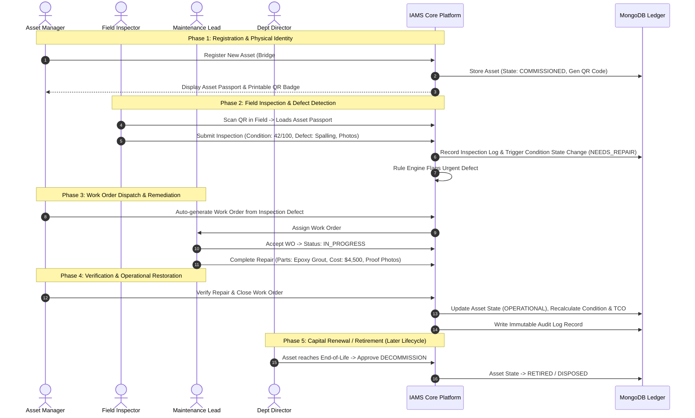
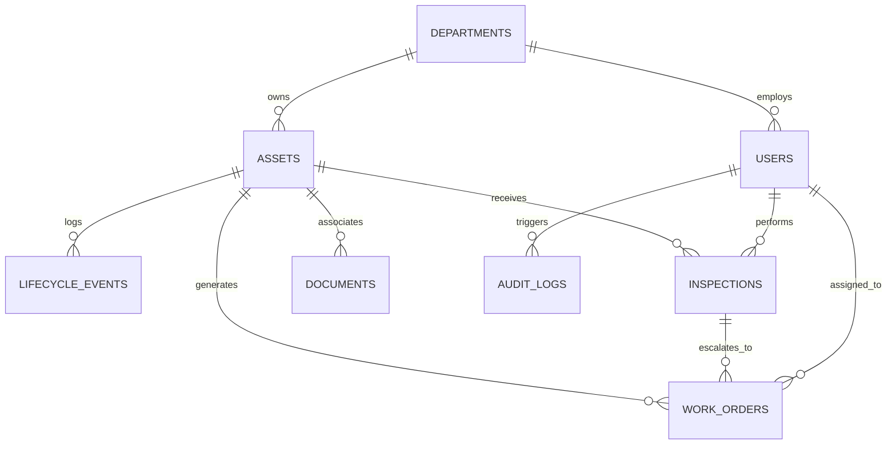

# INFRASTRUCTURE ASSET MANAGEMENT SYSTEM (IAMS)
## Product & Technical Architecture Blueprint
**Version:** 1.0.0-PROD-SPEC  
**Stack:** MongoDB, Express.js, React, Node.js (MERN) + Leaflet/GeoJSON  
**Target Environment:** Public Sector Physical Infrastructure Management  

---

## 1. Problem Interpretation & Domain Grounding

### 1.1 What the Problem is Really Asking For
Public sector infrastructure (roads, bridges, schools, municipal water networks, treatment plants, streetlights, public health facilities) represents trillions of dollars in public capital. In typical municipalities and public works agencies, this data is fractured across siloed legacy spreadsheets, paper inspection reports, disconnected work orders, and department-specific databases.

The problem statement—*"Building an end-to-end infrastructure asset inventory to track and manage assets across their entire lifecycle"*—is **not** a request for a basic CRUD inventory database. It demands an **Authoritative Asset Ledger of Record** that bridges physical-world reality with administrative governance.

### 1.2 The Core User Problem
1. **Asset Blindness:** Government executives lack an integrated spatial and operational view of what assets exist, where they are, what condition they are in, and who is responsible for them.
2. **Siloed Lifecycles:** Capital planning does not talk to field inspections; inspection discoveries do not automatically trigger work orders; maintenance records do not feed into lifecycle depreciation or replacement planning.
3. **Accountability & Audit Gaps:** When infrastructure deteriorates or fails, there is no immutable audit trail detailing who approved commissioning, who signed off on inspections, or whether deferred maintenance violated safety standards.
4. **Disconnection Between Field and Office:** Field engineers inspect physical assets with clipboards or disconnected tools, resulting in delayed data entry, lost photos, and lack of verified physical identity.

### 1.3 Defining "End-to-End" and "Entire Lifecycle"
In this government infrastructure platform, **"End-to-End"** means:
- **Registry & Identity:** Registering the asset with spatial boundary/point coordinates and assigning a unique tamper-evident identifier (UUID + QR tag).
- **Condition & Health Monitoring:** Continual assessment via structured field inspections using standard condition indices (e.g., Pavement Condition Index, Bridge Structural Sufficiency, Facility Condition Index).
- **Operational Intervention:** Transitioning discovered defects directly into scheduled or emergency maintenance work orders with assigned crews and tracked expenditures.
- **Financial Ledger:** Aggregating initial acquisition cost, routine upkeep, capital upgrades, and straight-line or usage depreciation into a running Total Cost of Ownership (TCO).
- **Decommissioning & Disposal:** Retiring assets through structured administrative sign-offs, salvaging, environmental clearance, and audit archiving.

---

## 2. Target Users & Role-Based Access Control (RBAC)

| Role Name | Real-World Persona | Core Operational Needs | System Permissions & Scope |
|:---|:---|:---|:---|
| **System Admin** | Chief Information Officer / GovIT Lead | User onboarding, department segregation, system configuration, audit compliance review. | Global read/write; user provisioning; RBAC assignments; system health & security logs. |
| **Department Director** | Public Works Director / Transport Commissioner | High-level condition heatmaps, departmental budget vs maintenance expenditure, compliance metrics, sign-off on asset retirement. | Department-wide read; approval authority for transitions to `DECOMMISSIONED` or high-value work orders; executive dashboard access. |
| **Asset Manager** | Infrastructure Portfolio Lead / Municipal Engineer | Registering new assets, modifying specifications, planning capital renewals, reviewing structural condition ratings, generating asset replacement plans. | Read/write assets, types, and locations; create lifecycle transitions; review and approve inspection reports; dispatch work orders. |
| **Field Inspector** | Certified Civil Inspector / Code Enforcement Officer | Mobile-responsive field inspection interface, rapid QR scanning, checklist verification, geo-tagged photo uploads, condition severity scoring. | Read assigned assets; submit new inspection logs and condition ratings; create defect alerts/flags. No direct edit of financial data or deletion of assets. |
| **Maintenance Contractor / Crew Lead** | Public Works Foreman / External Contractor | Accessing work orders, updating labor hours, recording parts replaced, uploading completion proof photos, resolving service tickets. | Read assigned work orders and associated asset specs; update work order state (`IN_PROGRESS`, `PENDING_REVIEW`, `COMPLETED`); log labor/material costs. |
| **Public Auditor / Compliance Officer** | State Comptroller / Environmental Inspector | Verifying chain-of-custody, reviewing grant/public fund expenditure per asset, inspecting safety adherence and statutory inspection intervals. | Read-only access across all modules; export access for tamper-evident audit logs, financial summaries, and compliance certs. |

---

## 3. Core End-to-End User Journeys



### Critical Edge-Case Journeys
- **Rejection of Defective Work Order:** If a Field Inspector re-inspects an asset and finds maintenance inadequate, the Work Order is reopened (`REWORK_REQUIRED`), keeping the asset in `NEEDS_REPAIR`.
- **Emergency Hazardous Flagging:** An inspector can toggle an emergency safety lockout (`OUT_OF_SERVICE`), immediately removing the asset from normal operations and alerting department directors.

---

## 4. Feature Architecture

### 4.1 MUST HAVE (Hackathon Core MVP - Fully Working)
- **Centralized Asset Registry:** Multi-category registration (Roads, Bridges, Facilities, Streetlights, Vehicles, Water) with geospatial coords (GeoJSON Point).
- **Physical QR Identity:** Unique tokenized QR code generation and printable asset passport view; mobile scan routing directly to the asset record.
- **Finite State Machine Lifecycle Engine:** Strict progression from `PLANNING` through `OPERATION` to `DISPOSAL` with validation rules.
- **GIS Map Command Center:** Interactive Leaflet map displaying colored condition markers, cluster grouping, layer filters (Department, Status, Condition Score), and popup cards.
- **Standardized Field Inspection Module:** Multi-point condition checklists, overall Condition Score (0–100), severity tagging, and evidence photo attachments.
- **Corrective Maintenance / Work Orders:** Direct conversion of inspection findings into assigned work orders with status tracking (`OPEN`, `ASSIGNED`, `IN_PROGRESS`, `RESOLVED`, `VERIFIED`).
- **Comprehensive Audit Log:** Automated tracking of all CRUD, lifecycle transitions, inspection ratings, and maintenance approvals with timestamps and user IDs.
- **Role-Based Authentication:** JWT-based auth with explicit role gates (`admin`, `manager`, `inspector`, `contractor`, `auditor`).

### 4.2 SHOULD HAVE (Production Prototype Finish)
- **Financial & TCO Tracker:** Initial cost, running maintenance costs, replacement cost estimates, and depreciation calculation (Straight-Line).
- **Document Management:** Metadata storage and attachments for warranties, blueprints, inspection certificates, and contractor invoices.
- **Notification Engine:** In-app notification center for overdue inspections, critical condition drops (<40), and SLA breaches on work orders.
- **Export Capabilities:** Export audit-ready PDF/CSV summary reports for legislative or regulatory compliance.

### 4.3 ADVANCED / DIFFERENTIATING (Targeted Strategic AI & Analytics)
- **Predictive Asset Deterioration Index (PADI):** Heuristic/ML hybrid risk scoring factoring age, inspection history, maintenance frequency, and weather exposure risk.
- **AI Inspection Anomaly & Summary Assistant:** LLM-powered synthesis of dense technical inspection notes into plain-English executive summaries and recommended intervention urgency.
- **Natural Language Asset Querying:** Natural language search converting prompts (e.g., *"Show bridges in District 4 with condition below 50 needing maintenance"*) into MongoDB filters.

---

## 5. Product Modules & Layout Navigation

```
IAMS Navigation
├── 1. Command Center Dashboard (Executive KPIs, Urgent Actions, Health Gauges)
├── 2. GIS Infrastructure Map (Spatial Layers, Filter Panel, Detail Drawer)
├── 3. Asset Registry & Directory (Faceted Search, Grid/Table View, Quick Filter)
│   ├── Asset Detail / Digital Passport (Full Specs, QR Badge, Financials)
│   └── Asset Registration / Edit Wizard (Step-by-step Gov Form)
├── 4. Inspection Manager (Scheduled Audits, Field Execution Form, Defect Log)
├── 5. Maintenance & Work Orders (Kanban Board / Table, Assignment, Cost Log)
├── 6. Lifecycle & Decommissioning Console (State Transitions, Approvals)
├── 7. Audit Ledger & Compliance (Tamper-evident Event Log, Exporters)
└── 8. System Administration (User Management, Department Config, Lookups)
```

---

## 6. Asset Lifecycle State Machine & Event Engine

### 6.1 Formal States
```
[PLANNING]
   │
   ▼
[PROCUREMENT]
   │
   ▼
[INSTALLATION]
   │
   ▼
[COMMISSIONING]
   │
   ▼
┌───────────────────► [OPERATION / HEALTHY] ◄────────────────────┐
│                              │                                │
│                              ▼                                │
│                     [UNDER_INSPECTION]                        │
│                              │                                │
│                              ▼                                │
│                       [NEEDS_REPAIR]                          │
│                              │                                │
│                              ▼                                │
│                      [UNDER_MAINTENANCE]                      │
│                              │                                │
│                              ▼                                │
└──────────────────── [MAINTENANCE_COMPLETED]                   │
                               │                                │
                               ▼                                │
                        [OUT_OF_SERVICE] ───────────────────────┘
                               │
                               ▼
                        [DECOMMISSIONED]
                               │
                               ▼
                           [DISPOSED]
```

### 6.2 Valid State Transitions & Enforcement Rules

| From State | Allowed To State | Authorized Roles | Business Rules & Triggers |
|:---|:---|:---|:---|
| `PLANNING` | `PROCUREMENT` | Admin, Manager | Requires Project Code, Estimated Budget, Approver ID. |
| `PROCUREMENT` | `INSTALLATION` | Admin, Manager | Requires Purchase Order #, Vendor ID, Delivery Date. |
| `INSTALLATION` | `COMMISSIONING` | Admin, Manager | Requires Contractor Sign-off, Location Verification. |
| `COMMISSIONING` | `OPERATION` | Admin, Manager | Requires Initial Baseline Inspection with Condition Score ≥ 80. |
| `OPERATION` | `UNDER_INSPECTION` | Admin, Inspector | Automated when Inspector initiates field checklist. |
| `UNDER_INSPECTION`| `OPERATION` | Inspector, Manager | If Inspection Condition Score ≥ 70 and no critical defects. |
| `UNDER_INSPECTION`| `NEEDS_REPAIR` | Inspector, Manager | If Inspection Condition Score < 70 or major defect flagged. |
| `NEEDS_REPAIR` | `UNDER_MAINTENANCE` | Manager, Contractor | When a Work Order transitions to `IN_PROGRESS`. |
| `UNDER_MAINTENANCE`| `MAINTENANCE_COMPLETED`| Contractor, Manager| Requires parts used, labor hours, and completion photos. |
| `MAINTENANCE_COMPLETED`| `OPERATION` | Manager | Requires Manager verification or satisfactory re-inspection. |
| `OPERATION` / `NEEDS_REPAIR` | `OUT_OF_SERVICE` | Admin, Manager, Inspector | Safety hazard emergency lockout. Freezes normal use. |
| `OUT_OF_SERVICE` | `UNDER_MAINTENANCE` | Manager | Work order dispatched for emergency corrective repair. |
| `OPERATION` / `OUT_OF_SERVICE` | `DECOMMISSIONED` | Admin, Director | Formal end-of-life approval with statutory memo attachment. |
| `DECOMMISSIONED`| `DISPOSED` | Admin | Salvage/Disposal certificate verified; assets archived. |

---

## 7. Asset Data Model Specification

Each asset contains standardized metadata alongside category-specific dynamic technical attributes.

```json
{
  "_id": "ObjectId('65f1a2b3c4d5e6f7a8b9c0d1')",
  "assetTag": "MUNI-BLD-2024-0082",
  "name": "Central District Civic Administrative Complex",
  "category": "BUILDING",
  "type": "Administrative Facility",
  "department": "Public Works & Real Estate",
  "status": "OPERATION",
  "criticality": "HIGH",
  "location": {
    "type": "Point",
    "coordinates": [77.2090, 28.6139],
    "address": "Civic Center Circle, Sector 4",
    "district": "Central Division",
    "jurisdiction": "Municipal Corporation Zone A"
  },
  "physicalAttributes": {
    "dimensions": { "grossFloorAreaSqFt": 45000, "floors": 4 },
    "yearConstructed": 2018,
    "manufacturer": "Apex Infrastructure Ltd",
    "modelOrSpec": "Seismic Zone IV Compliant Reinforced Concrete",
    "serialNumber": "N/A"
  },
  "condition": {
    "score": 78,
    "rating": "GOOD",
    "lastInspectedAt": "2026-08-15T09:30:00Z",
    "nextInspectionDue": "2027-02-15T00:00:00Z"
  },
  "financials": {
    "procurementCost": 12500000.00,
    "currency": "USD",
    "purchaseDate": "2017-06-10T00:00:00Z",
    "commissioningDate": "2018-09-01T00:00:00Z",
    "expectedLifeYears": 50,
    "salvageValue": 1000000.00,
    "depreciationMethod": "STRAIGHT_LINE",
    "accumulatedMaintenanceCost": 284500.00
  },
  "qrCode": {
    "identifier": "QR-7b89d42e-cf61-419b-a621-e01d898d249a",
    "dataUrl": "https://iams.gov/scan/QR-7b89d42e-cf61-419b-a621-e01d898d249a"
  },
  "responsibleParty": {
    "managerId": "ObjectId('...')",
    "managerName": "Sarah Jenkins, PE",
    "contactEmail": "sjenkins@gov.org",
    "departmentLead": "Director of Facilities"
  },
  "metadata": {
    "tags": ["civic", "high-occupancy", "solar-equipped"],
    "isHazardous": false,
    "customFields": {
      "fireSuppressionCertDate": "2026-01-12",
      "hvacRefrigerantType": "R-410A"
    }
  },
  "createdAt": "2024-01-10T08:00:00Z",
  "updatedAt": "2026-08-15T10:15:00Z"
}
```

---

## 8. Database Architecture (MongoDB & Mongoose)



### Proposed MongoDB Collections

1. **`users`**
   - Fields: `_id`, `name`, `email`, `passwordHash`, `role` (`ADMIN`, `DIRECTOR`, `ASSET_MANAGER`, `INSPECTOR`, `CONTRACTOR`, `AUDITOR`), `departmentId`, `phone`, `isActive`, `lastLoginAt`.
   - Index: `{ email: 1 }` (unique), `{ departmentId: 1, role: 1 }`.

2. **`departments`**
   - Fields: `_id`, `name`, `code` (`DPW`, `DOT`, `DWR`, `HEALTH`, `EDU`), `headUserId`, `budgetAnnual`, `allocatedSpend`.
   - Index: `{ code: 1 }` (unique).

3. **`assets`**
   - Fields: `_id`, `assetTag` (unique), `name`, `category`, `type`, `departmentId`, `status`, `criticality`, `location` (GeoJSON 2dsphere), `physicalAttributes`, `condition`, `financials`, `qrCode`, `responsibleParty`, `customAttributes`.
   - Indexes:
     - `{ "location": "2dsphere" }` (Spatial queries)
     - `{ assetTag: 1 }` (unique)
     - `{ "qrCode.identifier": 1 }` (unique, rapid lookup from field scan)
     - `{ departmentId: 1, category: 1, status: 1 }`
     - `{ "condition.score": 1 }`

4. **`lifecycle_events`**
   - Fields: `_id`, `assetId`, `fromState`, `toState`, `eventType` (`COMMISSIONED`, `INSPECTION_COMPLETED`, `MAINTENANCE_ORDERED`, `DECOMMISSIONED_REQUEST`), `triggeredById`, `reason`, `notes`, `evidenceDocumentUrls`, `timestamp`.
   - Indexes: `{ assetId: 1, timestamp: -1 }`.

5. **`inspections`**
   - Fields: `_id`, `inspectionNumber` (unique), `assetId`, `inspectorId`, `scheduledDate`, `performedDate`, `type` (`ROUTINE`, `SAFETY_AUDIT`, `EMERGENCY`, `POST_MAINTENANCE`), `checklistItems` [ { `checkName`, `category`, `score` (1-5), `passed`, `notes`, `photoUrl` } ], `overallConditionScore` (0-100), `conditionRating` (`EXCELLENT`, `GOOD`, `FAIR`, `POOR`, `CRITICAL`), `defectsFound` [ { `description`, `severity`, `recommendedAction` } ], `status` (`DRAFT`, `SUBMITTED`, `APPROVED`), `approverId`.
   - Indexes: `{ assetId: 1, performedDate: -1 }`, `{ inspectorId: 1, status: 1 }`.

6. **`work_orders`**
   - Fields: `_id`, `orderNumber` (unique), `assetId`, `inspectionId` (nullable), `title`, `description`, `priority` (`LOW`, `MEDIUM`, `HIGH`, `EMERGENCY`), `status` (`OPEN`, `ASSIGNED`, `IN_PROGRESS`, `PENDING_VERIFICATION`, `CLOSED`, `CANCELLED`), `assignedCrewLeaderId`, `assignedDepartmentId`, `targetCompletionDate`, `actualCompletionDate`, `costBreakdown` { `laborHours`, `laborRate`, `partsCost`, `contractorInvoice`, `totalCost` }, `resolutionNotes`, `proofOfWorkPhotos` [ `url` ], `verifiedById`.
   - Indexes: `{ assetId: 1, status: 1 }`, `{ assignedCrewLeaderId: 1, status: 1 }`, `{ priority: 1, status: 1 }`.

7. **`documents`**
   - Fields: `_id`, `assetId`, `workOrderId`, `inspectionId`, `title`, `docType` (`BLUEPRINT`, `WARRANTY`, `INVOICE`, `PERMIT`, `COMPLIANCE_CERT`), `fileUrl`, `mimeType`, `fileSize`, `uploadedById`, `createdAt`.
   - Index: `{ assetId: 1 }`.

8. **`audit_logs`**
   - Fields: `_id`, `entityName` (`ASSET`, `WORK_ORDER`, `INSPECTION`, `USER`), `entityId`, `action` (`CREATE`, `UPDATE`, `STATE_TRANSITION`, `DELETE_ATTEMPT`, `LOGIN`), `performedById`, `performerRole`, `ipAddress`, `userAgent`, `delta` { `before`, `after` }, `timestamp`.
   - Indexes: `{ entityId: 1, timestamp: -1 }`, `{ performedById: 1 }`, `{ timestamp: -1 }`.
   - Security rule: Append-only collection; `update` and `delete` disallowed at the Mongoose / DB driver level.

9. **`ai_insights`** (Strategic Differentiator)
   - Fields: `_id`, `assetId`, `insightType` (`DETERIORATION_RISK`, `INSPECTION_SYNTHESIS`, `BUDGET_ANOMALY`), `modelSignature`, `confidenceScore` (0.00–1.00), `rawInputsSnapshot`, `recommendationText`, `urgency` (`LOW`, `MEDIUM`, `CRITICAL`), `generatedAt`, `isAcknowledged`, `acknowledgedById`.
   - Index: `{ assetId: 1, generatedAt: -1 }`.

---

## 9. API Architecture (RESTful Endpoints)

All endpoints conform to `/api/v1` prefix. Token transmitted via `Authorization: Bearer <JWT>`.

### 9.1 Authentication & Profile (`/api/v1/auth`)
- **`POST /api/v1/auth/login`**
  - *Public*. Body: `{ email, password }`.
  - *Response (200)*: `{ token, user: { id, name, role, department } }`.
  - *Errors*: 401 (Invalid credentials), 403 (Account disabled), 429 (Rate limit).
- **`GET /api/v1/auth/me`**
  - *Auth: Any authenticated user*.
  - *Response (200)*: Current user profile and permission list.

### 9.2 Asset Ledger (`/api/v1/assets`)
- **`GET /api/v1/assets`**
  - *Auth: All roles*.
  - *Query Params*: `page`, `limit`, `category`, `status`, `conditionMin`, `conditionMax`, `departmentId`, `search`, `bbox` (minLng,minLat,maxLng,maxLat).
  - *Response (200)*: `{ data: [ Asset ], pagination: { total, page, pages } }`.
- **`POST /api/v1/assets`**
  - *Auth: `ADMIN`, `ASSET_MANAGER`*.
  - *Body*: Asset registration payload (name, category, location, financials, physical specs).
  - *Response (201)*: `{ success: true, asset: Asset, qrCode: { identifier, dataUrl } }`.
  - *Errors*: 400 (Validation failure), 409 (Duplicate assetTag).
- **`GET /api/v1/assets/:id`**
  - *Auth: All roles*.
  - *Response (200)*: Full asset passport including recent inspections, open work orders, and TCO summary.
- **`PATCH /api/v1/assets/:id`**
  - *Auth: `ADMIN`, `ASSET_MANAGER`*.
  - *Body*: Fields to update (cannot alter `status` directly).
  - *Response (200)*: Updated asset.
- **`POST /api/v1/assets/:id/transition-lifecycle`**
  - *Auth: `ADMIN`, `ASSET_MANAGER`, `DIRECTOR`*.
  - *Body*: `{ targetState: "UNDER_MAINTENANCE", reason: "Major structural fault detected", evidenceUrls: [] }`.
  - *Response (200)*: `{ success: true, fromState, toState, lifecycleEventId }`.
  - *Errors*: 400 (Invalid state transition per state machine), 403 (Unauthorized role for transition).
- **`GET /api/v1/assets/qr/:qrIdentifier`**
  - *Auth: All roles*.
  - *Purpose*: Immediate lookup upon scanning a physical QR code tag in the field.
  - *Response (200)*: Asset summary and rapid action links (New Inspection, New Incident Ticket).

### 9.3 Inspections (`/api/v1/inspections`)
- **`GET /api/v1/inspections`**
  - *Auth: All roles*. Query: `assetId`, `inspectorId`, `status`.
- **`POST /api/v1/inspections`**
  - *Auth: `ADMIN`, `ASSET_MANAGER`, `INSPECTOR`*.
  - *Body*: `{ assetId, type, checklistItems: [...], overallConditionScore, defectsFound: [...] }`.
  - *Side Effect*: If `overallConditionScore` < 60, triggers asset status transition to `NEEDS_REPAIR` and prompts work order creation.
  - *Response (201)*: Created Inspection record.
- **`GET /api/v1/inspections/:id`**
  - *Auth: All roles*. Full inspection details, checklist responses, photos.

### 9.4 Maintenance & Work Orders (`/api/v1/work-orders`)
- **`GET /api/v1/work-orders`**
  - *Auth: All roles*. Query: `status`, `priority`, `assetId`, `assignedTo`.
- **`POST /api/v1/work-orders`**
  - *Auth: `ADMIN`, `ASSET_MANAGER`*.
  - *Body*: `{ assetId, inspectionId, title, priority, targetCompletionDate, estimatedCost }`.
  - *Response (201)*: New work order.
- **`PATCH /api/v1/work-orders/:id/status`**
  - *Auth: `ADMIN`, `ASSET_MANAGER`, `CONTRACTOR`*.
  - *Body*: `{ status: "IN_PROGRESS" | "COMPLETED", laborHours, partsCost, completionPhotos, notes }`.
  - *Response (200)*: Updated work order.
  - *Side Effect*: On completion and manager sign-off, updates Asset accumulated maintenance cost and triggers condition re-evaluation.

### 9.5 GIS & Spatial Analytics (`/api/v1/spatial`)
- **`GET /api/v1/spatial/map-markers`**
  - *Auth: All roles*. Query: `category`, `status`, `healthTier` (`GOOD`, `WARNING`, `CRITICAL`), `bounds`.
  - *Response (200)*: GeoJSON FeatureCollection optimized for Leaflet marker clustering.

### 9.6 Governance & Audit (`/api/v1/audit`)
- **`GET /api/v1/audit`**
  - *Auth: `ADMIN`, `AUDITOR`, `DIRECTOR`*. Query: `entityName`, `entityId`, `dateFrom`, `dateTo`.
  - *Response (200)*: Chronological tamper-evident audit ledger entries with user details and before/after state diffs.

### 9.7 Decision Intelligence (`/api/v1/ai`)
- **`POST /api/v1/ai/risk-analysis/:assetId`**
  - *Auth: `ADMIN`, `ASSET_MANAGER`, `DIRECTOR`*.
  - *Response (200)*: `{ riskScore: 84, riskTier: "CRITICAL", predictedFailureHorizonMonths: 4.5, drivers: ["Deferred Joint Sealing", "High Traffic Loading"], recommendedAction: "Immediate resurfacing" }`.
- **`POST /api/v1/ai/nl-query`**
  - *Auth: All roles*.
  - *Body*: `{ query: "Find critical bridges in Central Zone not inspected in 12 months" }`.
  - *Response (200)*: `{ parsedFilters: { category: "BRIDGE", "condition.score": { $lt: 50 }, ... }, resultsCount: 4, results: [ ... ] }`.

---

## 10. Frontend Architecture (React Single Page App)

### 10.1 UI / Visual Design System & Aesthetics
- **Design Philosophy:** Premium Government Operations Center (GovOps Command). High-density, professional, modern glassmorphism accents, muted governmental navy/slate backdrop (`#0f172a`), crisp emerald/amber/rose status indicators, and clean typography (Inter / Outfit).
- **Accessibility:** High contrast ratios (WCAG AA compliant), clear keyboard focus rings, intuitive iconography (Lucide-react).

### 10.2 Component Hierarchy & Layout Structure
```
src/
├── app/
│   ├── routes.jsx                   # Central route definitions
│   └── App.jsx                      # Shell, auth provider, toast container
├── components/
│   ├── layout/
│   │   ├── SidebarNav.jsx           # Collapsible role-aware navigation
│   │   ├── TopbarHeader.jsx         # Global search, notifications, user chip
│   │   └── AppShell.jsx             # Shell wrapper with breadcrumb engine
│   ├── common/
│   │   ├── StatusBadge.jsx          # Color-coded badge for asset states
│   │   ├── ConditionGauge.jsx       # Circular SVG health meter (0-100)
│   │   ├── DataTable.jsx            # Faceted table with sort, pagination, CSV
│   │   ├── StatMetricCard.jsx       # Actionable metric card with trend indicator
│   │   └── ConfirmDialog.jsx        # Modal for destructive or transition actions
│   ├── gis/
│   │   ├── AssetMap.jsx             # Core Leaflet map wrapper
│   │   ├── MapFilterDrawer.jsx      # Slide-out spatial filter controls
│   │   └── AssetMapPopup.jsx        # Custom hover/click marker summary card
│   ├── assets/
│   │   ├── AssetPassportCard.jsx    # Complete identity sheet
│   │   ├── LifecycleTimeline.jsx    # Chronological step-progress timeline
│   │   ├── QRBadgeModal.jsx         # High-res SVG/Canvas QR viewer & print template
│   │   └── AssetRegistrationForm.jsx# Multi-step wizard (Category -> Geo -> Specs)
│   ├── inspections/
│   │   ├── ChecklistBuilder.jsx     # Dynamic inspection rubric by asset type
│   │   └── FieldInspectionModal.jsx # Rapid mobile-ready audit interface
│   └── workorders/
│       ├── WorkOrderKanban.jsx      # Drag/click status workflow board
│       └── CreateWorkOrderModal.jsx # Rapid dispatch from asset or inspection
├── context/
│   ├── AuthContext.jsx              # JWT session, role checks, login/logout
│   ├── NotificationContext.jsx      # In-app alert broadcasts
│   └── MapStateContext.jsx          # Synced active asset selection on map
├── services/
│   ├── api.js                       # Axios instance with auth interceptors
│   ├── assetService.js              # Asset CRUD & lifecycle calls
│   ├── inspectionService.js         # Inspection API bindings
│   ├── workOrderService.js          # Maintenance API bindings
│   └── aiService.js                 # AI scoring & natural language search
```

### 10.3 State Management & Data Fetching
- **Client State:** React Context API for Global Auth (`user`, `token`, `role`) and Map Interaction state (active selected asset, highlighted bounding box).
- **Server Cache & Async State:** Custom hooks with cache keys or standard React patterns ensuring stale data is refreshed on lifecycle mutation.
- **Form State:** Controlled inputs with schema validation (Zod-like or custom validation handlers).

---

## 11. Command-Center Dashboard Design

### 11.1 Actionable GovOps Metrics vs. Vanity Metrics
| Metric Name | Type | Formula / Source | Operational Action Triggered |
|:---|:---|:---|:---|
| **Critical Failure Risk Count** | Actionable | Count of assets with Condition Score < 40 or `PADI` risk > 80 | Clicking filters the map to immediately dispatch inspectors or order emergency lane/facility closures. |
| **Overdue Mandatory Inspections** | Actionable | Assets where `nextInspectionDue` < `Now()` | Highlights non-compliant departments vulnerable to regulatory fines. Dispatches batch inspection orders. |
| **Open Work Order SLA Breaches** | Actionable | Open work orders exceeding priority target date | Direct escalation to contractor foreman with penalty flags. |
| **Budget Committed vs. Spent** | Actionable | Cumulative maintenance spend vs. annual DPW allocation | Alerts directors when maintenance is consuming capital renewal reserves. |
| *Total Assets Registered* | Contextual | Count of all non-disposed assets | Baseline inventory volume. |

### 11.2 Dashboard Widgets
1. **Top KPI Strip:** 4 actionable metric cards (Critical Assets, Overdue Inspections, Pending Work Orders, 30-Day Maintenance Burn).
2. **Interactive Spatial Condition Overview:** Embedded responsive mini-GIS map highlighting critical clusters with quick-fullscreen toggle.
3. **Asset Health Spectrum:** Horizontal segmented progress distribution (Excellent, Good, Fair, Poor, Out of Service).
4. **Urgent Action Queue:** Live table of top 5 urgent items requiring sign-off (pending lifecycle retirement, severe inspection defects awaiting work order).
5. **Recent Lifecycle Activity Stream:** Chronological feed of latest field actions, status updates, and inspector submissions.

---

## 12. GIS & Spatial Mapping Engine

### 12.1 Spatial Data Representation
- Spatial data stored as native GeoJSON Point (`{ type: "Point", coordinates: [ longitude, latitude ] }`) indexed with MongoDB `2dsphere`.
- Linear or polygon assets (e.g., roads, park boundaries) represent their primary centroid marker for map pin clusters, with optional path coordinates stored in `physicalAttributes.geometry`.

### 12.2 GIS Engine Implementation Details
- **Base Map:** Leaflet.js with high-contrast, clean CartoDB Voyager or OpenStreetMap raster tiles (no costly proprietary API keys required).
- **Marker Color Coding:**
  - 🟢 **Emerald (#10b981):** Score 80–100 (`EXCELLENT` / `GOOD`)
  - 🟡 **Amber (#f59e0b):** Score 60–79 (`FAIR`)
  - 🔴 **Rose/Crimson (#f43f5e):** Score 0–59 (`POOR` / `CRITICAL` / `NEEDS_REPAIR`)
  - ⚪ **Slate (#64748b):** `OUT_OF_SERVICE` or `DECOMMISSIONED`
- **Dynamic Interaction:**
  - Hovering a marker shows a compact card (Asset Tag, Category, Health Score).
  - Clicking a marker opens a dedicated **Flyout Drawer** showing full specs, recent defects, and quick buttons: *"Perform Field Inspection"* and *"View Asset Passport"*.
  - Category filters (Roads, Bridges, Facilities, Water) instantly filter markers client-side or fetch via spatial bounding box query (`$geoWithin`).

---

## 13. Digital Inspection System

### 13.1 Inspection Workflow
1. **Initiation:** Inspector scans asset QR code or selects asset from assigned scheduled inspection queue.
2. **Standardized Rubric by Asset Category:**
   - *Bridge:* Structural deck condition, abutment erosion, joint expansion, bearing pad integrity, safety railings.
   - *Road:* Pothole density, surface cracking (alligatoring), drainage flow, road markings visibility.
   - *Building:* HVAC operation, emergency exits, structural foundations, roof integrity, fire equipment certification.
3. **Scoring Model:** Each checklist item scored 1 (Failure) to 5 (Flawless). Algorithmic weighted formula computes normalized **Overall Condition Score (0–100)**:
   $$\text{Condition Score} = \left(\frac{\sum (\text{item\_score}_i \times \text{weight}_i)}{5 \times \sum \text{weight}_i}\right) \times 100$$
4. **Defect Capture:** If any item scores $\le 2$, inspector is prompted to provide defect description, severity (`MINOR`, `MODERATE`, `SEVERE`), and upload photographic evidence.
5. **Submission & Automatic Escalation:**
   - If Score $< 60$ or severe defect logged: Asset state automatically shifts to `NEEDS_REPAIR`.
   - Inspection notification dispatched to Asset Manager with pre-drafted Work Order.

---

## 14. Work Order & Maintenance System

### 14.1 Defect-to-Closure Workflow
```
[Defect Flagged in Inspection]
            │
            ▼
   [Create Work Order] ──(Auto-populates asset, location, defect photos)
            │
            ▼
     [Triage & Assign] ──(Sets Priority, Target SLA Date, Assigns Crew)
            │
            ▼
      [IN_PROGRESS]    ──(Crew logs hours, parts used, repair steps)
            │
            ▼
   [COMPLETED by Crew] ──(Uploads completion photos, total repair cost)
            │
            ▼
 [VERIFIED by Manager] ──(Signs off, updates Asset TCO & Condition Score)
            │
            ▼
         [CLOSED]
```

### 14.2 Cost & Resource Ledger
Every completed work order writes to the asset's `financials.accumulatedMaintenanceCost`. If the repair was a capital upgrade (e.g., bridge deck replacement), the manager can toggle *"Capital Improvement"*, extending the asset's `expectedLifeYears` and capitalizing the cost.

---

## 15. Regulatory Audit Trail & Governance Logging

### 15.1 Auditable Events
The system guarantees complete auditability for:
- Asset creation, attribute updates, and deletion attempts.
- All lifecycle state machine transitions (who approved, old state, new state, justification).
- Inspection score submissions and condition updates.
- Work order creation, crew assignment, and completion sign-off.
- User authentication, permission changes, and role reassignments.

### 15.2 Tamper-Evident Audit Record Schema
```json
{
  "_id": "ObjectId('65f1e9a4c8d7e6f5a4b3c2d1')",
  "timestamp": "2026-09-28T09:14:22.184Z",
  "entityName": "ASSET",
  "entityId": "65f1a2b3c4d5e6f7a8b9c0d1",
  "action": "STATE_TRANSITION",
  "performedBy": {
    "userId": "65f19001b2c3d4e5f6a7b8c9",
    "name": "David Vance",
    "role": "DIRECTOR",
    "department": "Department of Public Works"
  },
  "ipAddress": "192.168.1.104",
  "userAgent": "Mozilla/5.0 (Windows NT 10.0; Win64; x64)...",
  "delta": {
    "fromState": "OPERATION",
    "toState": "OUT_OF_SERVICE"
  },
  "justification": "Emergency structural joint failure observed during seismic audit.",
  "integrityHash": "sha256(prevHash + timestamp + entityId + delta)"
}
```

---

## 16. Financial Lifecycle Tracking & Total Cost of Ownership (TCO)

### 16.1 Financial Mathematical Model
- **Book Value Calculation (Straight-Line Depreciation):**
  $$\text{Annual Depreciation} = \frac{\text{Procurement Cost} - \text{Salvage Value}}{\text{Useful Life Years}}$$
  $$\text{Current Book Value} = \text{Procurement Cost} - (\text{Annual Depreciation} \times \text{Asset Age Years})$$
- **Total Cost of Ownership (TCO):**
  $$\text{TCO} = \text{Procurement Cost} + \sum \text{Routine Maintenance Costs} + \sum \text{Emergency Repair Costs}$$
- **Repair vs. Replace Index (Economic Threshold):**
  $$\text{Deterioration Ratio} = \frac{\text{Accumulated Maintenance Costs}}{\text{Current Replacement Cost}} \times 100$$
  *Policy rule:* When the ratio exceeds 65%, the system automatically flags the asset for **Capital Renewal Planning** rather than continued incremental repairs.

---

## 17. Physical QR Asset Identity & Field Verification

### 17.1 Workflow
```
[System Asset Creation]
          │
          ▼
[Generates Unique UUID Identifier] ── (e.g., QR-7b89d42e-cf61-419b-a621-e01d898d249a)
          │
          ▼
[Generates High-Resolution QR Vector] ── (Encoded URL: /scan/:identifier)
          │
          ▼
[Printable Physical Badge] ── (Contains Asset Tag, Name, Dept, QR Code, Barcode)
          │
          ▼
[Field Inspector Scans Badge via Camera]
          │
          ▼
[Routes to Mobile Fast-Action Passport]
          │
    ┌─────┴────────────────────────┐
    ▼                              ▼
[View Condition & History]    [Execute Field Inspection]
```

### 17.2 Security of Physical Tags
- QR codes do not encode raw internal database IDs; they contain an unguessable UUID token (`qrCode.identifier`).
- Accessing the scan URL requires user authentication; unauthorized public scanners are redirected to a public verification page showing non-sensitive data (Asset Name, Operating Agency, Public Safety Hotline).

---

## 18. Strategic AI Capabilities (Non-Decorative & Value-Driven)

### 18.1 Predictive Asset Deterioration Index (PADI)
- **Problem:** Governments only repair assets after failure or when citizen complaints occur.
- **Solution:** A weighted analytical risk-scoring algorithm that computes failure probability (0–100) based on:
  1. Current Age vs. Design Useful Life.
  2. Rate of condition score degradation across last 3 inspections.
  3. Total accumulated work orders in the past 12 months.
  4. Environmental / asset criticality multipliers (e.g., high traffic bridges vs. park benches).
- **Presentation:** Displayed as a predictive warning badge with explicit factor explanations (*"Why this score?"* popup), preventing "black-box" distrust among civil engineers.

### 18.2 AI-Assisted Inspection Synthesis & Plain-Language Summary
- **Problem:** Inspectors write dense, technical jargon notes that department directors do not have time to parse.
- **Solution:** A lightweight LLM service that synthesizes inspection checklist outputs, defect severity, and notes into:
  - 2-sentence Executive Summary.
  - Priority Level Recommendation (`IMMEDIATE_ACTION`, `NEXT_CYCLE`, `MONITOR`).
  - Draft scope-of-work text for the maintenance ticket.
- **Deterministic Separation:** The LLM's recommendation is explicitly flagged as `[AI GENERATED ADVISORY]`; it cannot alter database states without human confirmation.

### 18.3 Natural Language Asset Querying
- Translates natural speech queries (e.g., *"Show me all critical water pumps with maintenance cost over $10,000"*) into structured MongoDB filter objects, empowering non-technical municipal leaders to extract instant insights.

---

## 19. Enterprise Security Architecture & Hardening

1. **Authentication & Session:**
   - Password hashing via `bcrypt` with work factor 12.
   - Short-lived stateless JWT access tokens signed with HMAC-SHA256.
2. **Authorization (RBAC):**
   - Express middleware `authorize(['ADMIN', 'ASSET_MANAGER'])` guarding all state-changing endpoints.
   - Resource-level checks: Contractors can only inspect/update work orders assigned specifically to their team.
3. **Input Sanitization & Validation:**
   - Strict schema validation using clean sanitization middleware; reject unrecognized keys to prevent parameter tampering.
   - Prevention of NoSQL injection via explicit casting of string parameters (avoiding raw `{ $gt: '' }` object injection).
4. **File & Evidence Storage Security:**
   - File uploads validated for MIME type (`image/jpeg`, `image/png`, `application/pdf`) and size (max 5MB).
   - In hackathon prototype, assets saved to structured local `/uploads` or Cloudinary/S3 stub with randomized UUID filenames, never executing server-side.
5. **Rate Limiting & Headers:**
   - Rate limiting on auth endpoints (max 10 attempts per 15 min).
   - Security headers enforced via `helmet` (X-Content-Type-Options, Frameguard, XSS protection).

---

## 20. Error Handling, Fault Tolerance & Reliability

| Failure Scenario | Technical Root Cause | System Defensive Mitigation | User Experience |
|:---|:---|:---|:---|
| **Invalid State Transition** | User attempts `PLANNING` $\rightarrow$ `OPERATION` without commissioning | State machine throws custom `LifecycleTransitionError` (400) | Clear modal notification explaining missing prerequisite steps (e.g., *"Baseline inspection required"*). |
| **GeoJSON Out of Range** | Lat/Long coordinates transposed or outside standard earth bounds | Mongoose 2dsphere schema validation | Form highlights input fields with message: *"Latitude must be between -90 and +90"*. |
| **Simultaneous Status Update** | Two managers approve different actions at the same instant | Mongoose optimistic concurrency (`__v` versioning) | Second request receives 409 Conflict: *"Asset was modified by another user. Reloading latest state."* |
| **AI Service Downtime** | External LLM API rate limit or network timeout | Graceful timeout fallback (2-second limit) with default heuristic rules | System displays deterministic condition metrics with notice: *"AI synthesis temporarily unavailable"*. Core app never crashes. |
| **Offline Field QR Scan** | Inspector scans tag in remote location with no cellular signal | PWA Service Worker caching core passport data | Offline notification with cached asset view and queue for inspection sync upon reconnect. |

---

## 21. Multi-Tier Testing Strategy

1. **Unit Tests (Backend):**
   - Lifecycle state machine transitions: Ensure all illegal transitions throw predictable exceptions.
   - Straight-line depreciation and TCO calculation logic.
   - Condition score weighting mathematical engine.
2. **Integration Tests (API Layer):**
   - Auth & RBAC: Ensure `CONTRACTOR` cannot access `/api/v1/assets` POST or `/api/v1/audit`.
   - Inspection submission: Verify that scoring $< 60$ automatically updates asset status to `NEEDS_REPAIR`.
   - Audit trail verification: Confirm every state transition creates a corresponding immutable log in `audit_logs`.
3. **Frontend Component Tests:**
   - Interactive GIS Map: Verify filter toggles accurately update visible markers.
   - QR code generation and print modal rendering.
4. **End-to-End User Journey Tests:**
   - Create asset $\rightarrow$ generate QR $\rightarrow$ simulate field scan $\rightarrow$ submit failing inspection $\rightarrow$ auto-generate work order $\rightarrow$ close work order $\rightarrow$ verify asset returned to `OPERATIONAL`.

---

## 22. Phased Hackathon Implementation Roadmap

```
PHASE 0: Blueprint & Setup (Current)
  └── Architecture, DB design, API contract, Schema validation rules.

PHASE 1: Core Foundation & Data Layer (Day 1 Morning)
  ├── Express + Mongoose server setup with DB connection.
  ├── Models: User, Department, Asset (GeoJSON + Lifecycle), AuditLog.
  ├── Authentication & RBAC middleware (`auth`, `hasRole`).
  └── Seed Script: Realistic government infrastructure assets (Bridges, Roads, Buildings, Water).

PHASE 2: Core Asset Management & GIS Command Center (Day 1 Afternoon)
  ├── Asset CRUD REST endpoints & lifecycle transition logic.
  ├── Frontend shell: Dark GovOps theme, navigation, layout.
  ├── Leaflet GIS Map: Clustered markers, condition color coding, filter drawer.
  └── Asset Passport View: Specs, condition gauge, lifecycle timeline.

PHASE 3: Inspection & Work Order Closed-Loop Engine (Day 1 Evening)
  ├── Inspection Checklist submission endpoint & condition score engine.
  ├── Auto-escalation of failed inspections to Work Orders.
  ├── Work Order Kanban / list with contractor assignment and resolution.
  └── QR Code generation & mobile-responsive scan landing page.

PHASE 4: Audit Trail, Financials & Analytics (Day 2 Morning)
  ├── Immutable Audit Log viewer with entity timeline diffs.
  ├── Financial TCO calculation & depreciation display on Asset Passport.
  └── Executive Dashboard KPIs: Critical counts, overdue inspections, SLA alerts.

PHASE 5: Strategic AI Differentiator & Polish (Day 2 Midday)
  ├── Predictive Asset Deterioration Index (PADI) heuristic/ML service.
  ├── Natural Language query filter for assets.
  ├── Realistic data polish: Mock photos, real municipal coordinates.
  └── Dry-run end-to-end demo flow.
```

---

## 23. High-Impact 3–5 Minute Demonstration Script

- **0:00 - 0:45 | The Hook & Executive Command Center**
  - Open on the GovOps Command Dashboard.
  - *"Governments manage trillions in public infrastructure, but data is trapped in filing cabinets. This is IAMS—an authoritative lifecycle ledger."*
  - Show the 4 actionable KPIs and the real-time Leaflet map of municipal assets colored by physical condition.
- **0:45 - 1:45 | Physical Asset Identity & The Field Inspection**
  - Select "Mill Creek Bridge" on the map. Show its Digital Asset Passport.
  - Click "Print QR Identity". Pull up mobile view / scan simulation.
  - Launch Field Inspection: Submit a failing structural deck rating (Score: 38/100, "Spalling concrete observed").
  - Show instant state change: Asset flips to `NEEDS_REPAIR`.
- **1:45 - 2:45 | Automated Work Order Resolution**
  - Show the Work Order automatically spawned from the defect.
  - Switch to Contractor persona: Accept order, log $4,800 repair cost, attach repair photo, submit completion.
  - Manager verifies repair: Asset status returns to `OPERATION`, and TCO updates dynamically.
- **2:45 - 3:30 | Strategic Intelligence & Audit Compliance**
  - Switch to Director/Auditor view: Open Audit Trail. Show the cryptographic, tamper-evident log of every action taken in the demo.
  - Demonstrate AI Natural Language Query: *"Find critical water infrastructure in Sector 2"* -> Instant filtered results.
- **3:30 - 4:00 | Conclusion & Impact**
  - Summarize the value: Zero data loss, verifiable field-to-office accountability, extended asset lifespans, and public tax dollar efficiency.

---

## 24. Scope Protection & Anti-Patterns (What NOT to Build)

To ensure hackathon victory with a rock-solid, bug-free prototype, avoid these scope traps:
1. **NO Complex Multi-Polygon GIS Editing:** Do not attempt in-browser CAD drawing of complex municipal road polygon meshes. Use standard GeoJSON Points with centroid coordinates.
2. **NO Native iOS/Android App:** Build a fully responsive web app with camera QR scanning (`html5-qrcode` or standard barcode API). It works on any mobile browser without app-store deployment friction.
3. **NO Real Payment Gateways:** Government work orders use internal procurement budgets; mock the invoice/cost ledger without Stripe/PayPal overhead.
4. **NO Black-Box Unverifiable AI:** Do not build generative AI that writes arbitrary database records unprompted. Use AI for advisory synthesis and natural language filtering.
5. **NO Over-Engineered Microservices:** Keep everything inside a clean modular MERN monolith. Microservices add devOps latency with zero hackathon upside.

---

## 25. Final End-to-End Technical Flow Diagram

```
┌────────────────────────────────────────────────────────────────────────┐
│                        FRONTEND CLIENT (React)                         │
│  ┌───────────────────────┐  ┌───────────────────┐  ┌────────────────┐  │
│  │   Command Dashboard   │  │  Leaflet GIS Map  │  │ Asset Passport │  │
│  └───────────────────────┘  └───────────────────┘  └────────────────┘  │
│  ┌───────────────────────┐  ┌───────────────────┐  ┌────────────────┐  │
│  │ Field Inspection Form │  │ Work Order Kanban │  │ QR Scan Engine │  │
│  └───────────────────────┘  └───────────────────┘  └────────────────┘  │
└───────────────────────────────────┬────────────────────────────────────┘
                                    │ HTTP / REST (JWT Bearer)
                                    ▼
┌────────────────────────────────────────────────────────────────────────┐
│                      BACKEND SERVER (Express / Node)                   │
│  ┌──────────────────────────────────────────────────────────────────┐  │
│  │ API Routing & Controllers (/assets, /inspections, /workorders)   │  │
│  └──────────────────────────────────┬───────────────────────────────┘  │
│                                     │
│  ┌──────────────────────────────────┴───────────────────────────────┐  │
│  │ Middleware: JWT Auth • RBAC Validator • Input Sanitizer • Helmet │  │
│  └──────────────────────────────────┬───────────────────────────────┘  │
│                                     │
│  ┌──────────────────────────────────┴───────────────────────────────┐  │
│  │ Core Domain Business Engines:                                    │  │
│  │  • Lifecycle State Machine Engine (Transitions & Guard Rules)   │  │
│  │  • Condition Scoring & Defect Escalation Engine                  │  │
│  │  • Financial TCO & Straight-Line Depreciation Engine             │  │
│  │  • Automated Immutable Audit Logger                              │  │
│  └──────────────────────────────────┬───────────────────────────────┘  │
└───────────────────────────────────┬─┴──────────────────────────────────┘
                                    │
           ┌────────────────────────┴───────────────────────┐
           ▼                                                ▼
┌───────────────────────────────────┐    ┌──────────────────────────────────┐
│         DATABASE LAYER            │    │        EXTERNAL SERVICES         │
│         MongoDB + Mongoose        │    │  • OpenStreetMap / CartoDB       │
│  • assets (2dsphere GIS indexed)  │    │    (Free GIS Map Tiles)          │
│  • lifecycle_events               │    │  • LLM API (Groq/OpenAI/Gemini) │
│  • inspections & work_orders      │    │    (Advisory Synthesis & NL)     │
│  • audit_logs (Append-Only)       │    │  • QRCode Engine (Vector SVG)    │
│  • users & departments            │    │                                  │
└───────────────────────────────────┘    └──────────────────────────────────┘
```

---

## Appendices & Strategic Summaries

### A. Recommended Final Feature Set
- **Core Platform:** Asset Ledger (6 categories), Geospatial Map with condition clusters, QR passport generator/scanner, Lifecycle state machine (9 distinct states), Inspection checklist & defect capture, Maintenance work order tracking with costs, Immutable audit trail, Role-based login (Admin, Director, Manager, Inspector, Contractor).
- **Targeted Innovations:** Predictive Asset Deterioration Index (PADI), Automated Defect-to-Work-Order Escalation, Natural Language Query interface, Total Cost of Ownership calculator.

### B. Recommended MERN Architecture
- **Monorepo Structure:**
  - `/client`: React (Vite-based for instant HMR), Vanilla CSS / Tailwind (if preferred, or structured modern CSS modules), Leaflet + React-Leaflet, Lucide icons, Html5-qrcode.
  - `/server`: Express.js, Mongoose, JWT, Bcrypt, Helmet, Cors, Morgan, Express-rate-limit.

### C. Proposed Database Collection List
1. `users`
2. `departments`
3. `assets`
4. `lifecycle_events`
5. `inspections`
6. `work_orders`
7. `documents`
8. `audit_logs`
9. `ai_insights`

### D. Proposed API Module List
1. `/api/v1/auth` (Authentication & Session)
2. `/api/v1/assets` (Ledger, QR lookup, Lifecycle transitions)
3. `/api/v1/inspections` (Checklist audits & Condition scoring)
4. `/api/v1/work-orders` (Maintenance dispatch, costing & closure)
5. `/api/v1/spatial` (GeoJSON map markers & cluster data)
6. `/api/v1/audit` (Governance log queries)
7. `/api/v1/ai` (Predictive risk & natural language filtering)

### E. Recommended Development Phases
- **Phase 1:** Backend Models, Auth/RBAC, State Machine & Database Seeding.
- **Phase 2:** Asset CRUD, Leaflet GIS Map & Digital Passport UI.
- **Phase 3:** Field Inspection, Automated Work Order Escalation & QR Scanning.
- **Phase 4:** Immutable Audit Trail, Financial TCO Engine & Executive Dashboard.
- **Phase 5:** AI Risk Scoring, Natural Language Search, Demo Polish.

### F. Open Decisions That We Must Review Before Coding
1. **Frontend Styling Preference:** Vanilla CSS with custom GovOps Design Tokens vs. Tailwind CSS (confirming user stack preference).
2. **AI Provider / Mock Fallback:** Whether to connect to a live LLM API key (e.g., Gemini / Groq / OpenAI) or use an offline deterministic rule-based heuristic with optional API integration.
3. **Target Municipal Geo-Boundary:** Selecting a default city/district coordinates for the seed dataset (e.g., New Delhi, New York, San Francisco, or a generic Municipal Zone) to give map markers immediate visual density.
